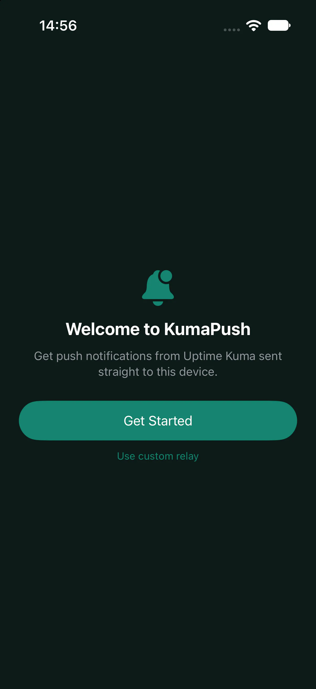
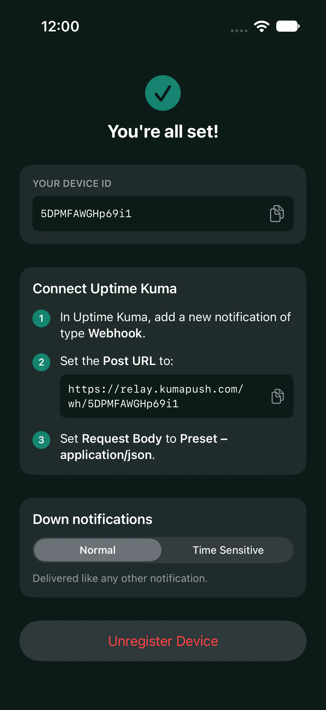
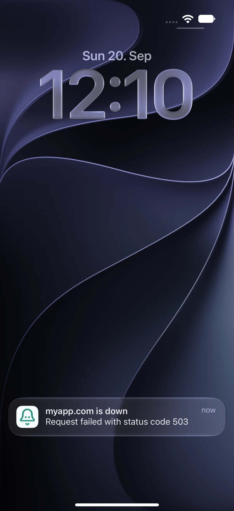

# KumaPush

Get Uptime Kuma downtime alerts as push notifications on your iPhone. Set up in under a minute, with optional Time Sensitive delivery that breaks through Focus.

## Getting Started

1. **Open KumaPush and tap Get Started**

    Allow notifications when iOS asks. The app registers your phone with the relay.

2. **Add a Webhook notification in Uptime Kuma**

    Paste your personal URL from the app as the Post URL and set the request body to Preset - application/json.

3. **Press Test**

    A notification should land on your phone within seconds. Attach it to your monitors and you're done.

You can read the full setup guide [here](https://kumapush.com/docs/getting-started/).

## Screenshots

<table>
  <tr>
    <td>
      
    </td>
    <td>
      
    </td>
    <td>
      
    </td>
  </tr>
</table>

## Contributing

Please read the [development guide](https://kumapush.com/docs/development/) before submitting a pull request.

## License

This project is licensed under the GNU General Public License v3.0 - see the [LICENSE](./LICENSE) file for details.
